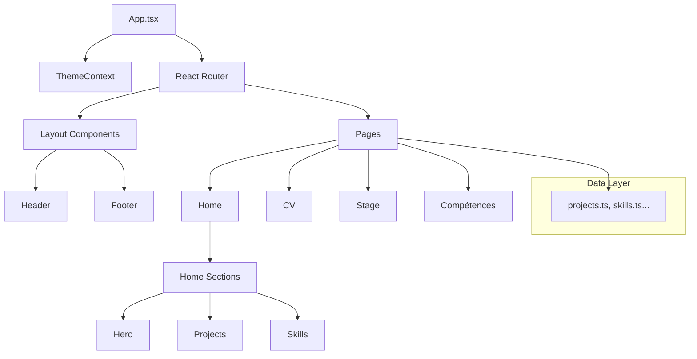

# Architecture du Projet

Cette documentation présente la structure et les flux de données du projet.

## Diagramme des Composants

## Flux de Données

1. **ThemeContext** : Gère l'état sombre/clair globalement.
2. **React Router** : Gère la navigation entre les pages avec des transitions `framer-motion`.
3. **Data** : Les contenus (projets, compétences) sont centralisés dans `src/data` pour faciliter la maintenance.

## Tests

Les tests sont gérés par **Vitest** et **React Testing Library**.

- Commande : `npm run test`
- Configuration : `vitest.config.ts`
