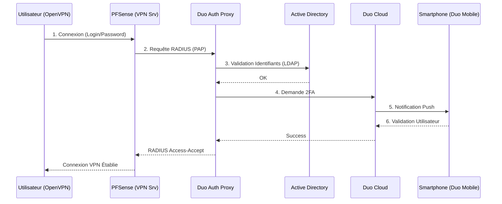

# PROCÉDURE VPN MFA

**Auteur:** Lilian Charron  
**Date:** 14/01/2026

## Architecture du Flux d'Authentification

## 1. Procédure d'installation VPN MFA

### Configuration SRV DUO

**Configuration Admin Panel Duo:**

Tout d'abord, pensez à ajouter votre groupe d'utilisateurs qui se connecteront en VPN dans **Users > External Directories**.

![[S] Section Sync Controls](/assets/img/procedures/vpn-mfa/Configpanelduo.png)

Ajoutez à vos applications RADIUS. Rendez-vous dans l'onglet **Application > Application Catalog**, recherchez "Radius" et ajoutez-le.

![[S] Section RADIUS application](/assets/img/procedures/vpn-mfa/Appliradius.png)

---

Pensez à configurer les utilisateurs qui se connecteront en RADIUS (soit tous, soit un groupe de votre Active Directory). Par défaut, l'application est en "Disable".

![[M] Configuration RADIUS user access](/assets/img/procedures/vpn-mfa/parametreappradius.png)

Dans les **détails**, vous retrouverez votre **Integration key**, **Secret key** et l'**API hostname** qui serviront pour la configuration du serveur Duo.

![[S] Section Details avec key, skey et api](/assets/img/procedures/vpn-mfa/parametreradius2.png)

Plus bas, cochez l'option pour accepter le mail comme authentification (Username normalization).

![[S] Section Settings normalization](/assets/img/procedures/vpn-mfa/parametreradius3.png)

### Configuration SRV DUO (Proxy)

Ouvrez votre panel **Duo Authentication Proxy Manager**.

![[L] Duo Authentication Proxy Manager interface complète](/assets/img/procedures/vpn-mfa/configDUoproxy.png)

**Fichier Config Duo (authproxy.cfg) :**

| Section | Paramètre | Description |
| :--- | :--- | :--- |
| **[ad_client]** | `host=172.31.10.14` | IP Serveur AD |
| | `service_account_username=Administrateur` | Utilisateur de service |
| | `service_account_password=******` | Mot de passe |
| | `search_dn=DC=labolo,DC=local` | Domaine |
| **[cloud]** | `ikey=DIPBX3CPVAGZcH21KIH` | Key Admin Panel Sync AD |
| | `skey=AvSfAtDIwaRHCbhAAXLL...` | Skey Admin Panel Sync AD |
| | `api_host=api-4c853da5.duosecurity.com` | API Duo Secure AD |
| **[radius_server_auto]** | `ikey=DI505STC68OM34VY318UZ` | Key Radius |
| | `skey=sR2If6094cxH0WfCDLJyObMR...` | Skey Radius |
| | `api_host=api-4c853da5.duosecurity.com` | API Duo Secure Radius |
| | `radius_ip_1=172.31.1.253` | IP Interface PFSense |
| | `radius_secret_1=****************` | Shared Secret avec PFSense |
| | `failmode=secure` | Mode de sécurisation |
| | `client=ad_client` | Client AD référence |
| | `port=1812` | Port RADIUS |

> *Retrouvez vos clés Syncro AD dans : User > External Directories*

![[L] Tableau de configuration authproxy.cfg](/assets/img/procedures/vpn-mfa/configDUoproxy.png)

Validez ensuite le fichier de configuration et vérifiez s'il y a des erreurs. Si aucun message d'erreur n'apparaît, sauvegardez et relancez votre service.

---

### Configuration PFSENSE

Créez un **Authentication Server** pour envoyer du RADIUS PAP vers notre serveur Duo.

> **Important :** Pensez à augmenter le délai (Timeout) pour la requête afin d'avoir le temps de valider le MFA, sinon la requête sera rejetée avant la validation.

Le **Shared Secret** est le code `radius_secret_1` que vous avez renseigné plus tôt.

Allez dans : **System > User Manager > Authentication Servers > Edit**

![[L] Configuration complète Pfsense RADIUS](/assets/img/procedures/vpn-mfa/pfsenseconfig.png)

### Test Requête RADIUS

Il faut maintenant vérifier si votre requête fonctionne bien. Rendez-vous dans **Diagnostics > Authentication**.

![[S] Navigation vers Diagnostics > Authentication](/assets/img/procedures/vpn-mfa/pfsenseconfig2.png)

Arrivé sur l'interface, sélectionnez votre Authentication Server (RADIUS) et entrez un mail et mot de passe de votre AD.

![[M] Interface test d'authentification RADIUS](/assets/img/procedures/vpn-mfa/pfsenseconfig3.png)

Si tout fonctionne, vous recevrez un push à valider et le message de succès de connexion s'affichera.

## 2. Configuration OpenVPN

### Configuration de Serveur OpenVPN

Ajout d'un serveur ou modification afin de se servir de notre serveur d'authentification précédemment configuré et testé.

Désactivez la déconnexion au bout de 300sec en définissant le **Inactivity Timeout** à `0`, car sinon un push vous sera envoyé toutes les 300sec.

![[S] Configuration Inactivity Timeout](/assets/img/procedures/vpn-mfa/pfsenseconfig4.png)

**Résultat :**

![[L] Liste des serveurs OpenVPN](/assets/img/procedures/vpn-mfa/pfsenseconfig5.png)

### Configuration de Client OpenVPN

Allez ensuite sur **Client Export** afin de récupérer le client en téléchargeant le fichier `.ovpn`.

![[M] Interface Client Export avec options de téléchargement](/assets/img/procedures/vpn-mfa/pfsenseconfig6.png)

Après le lancement du `.ovpn`, vous aurez une nouvelle connexion sur votre client OpenVPN. 
Lancez la connexion, entrez votre Mail et votre mot de passe. Vous recevrez un push ; une fois accepté, la connexion VPN s'établira.

**Interface Client Windows :**

![[M] Interface client OpenVPN Windows](/assets/img/procedures/vpn-mfa/ClientOPenVPN.png)

**Notification Push Duo Mobile :**

![[Mob] Notification push Duo Mobile](/assets/img/procedures/vpn-mfa/ClientOpenvpn2.png)
